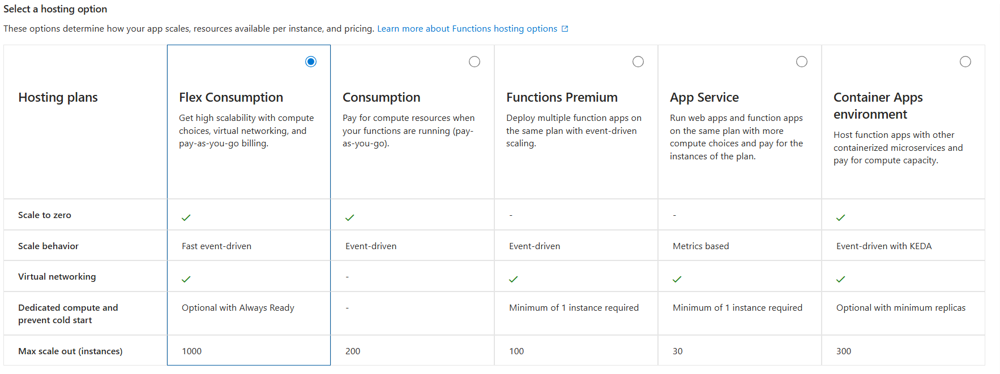
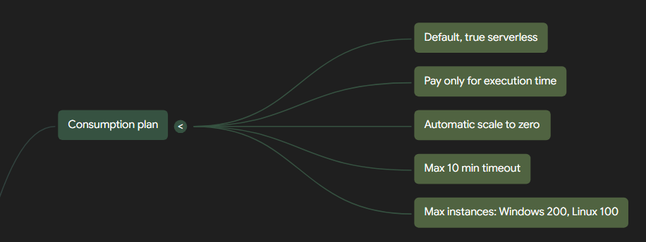
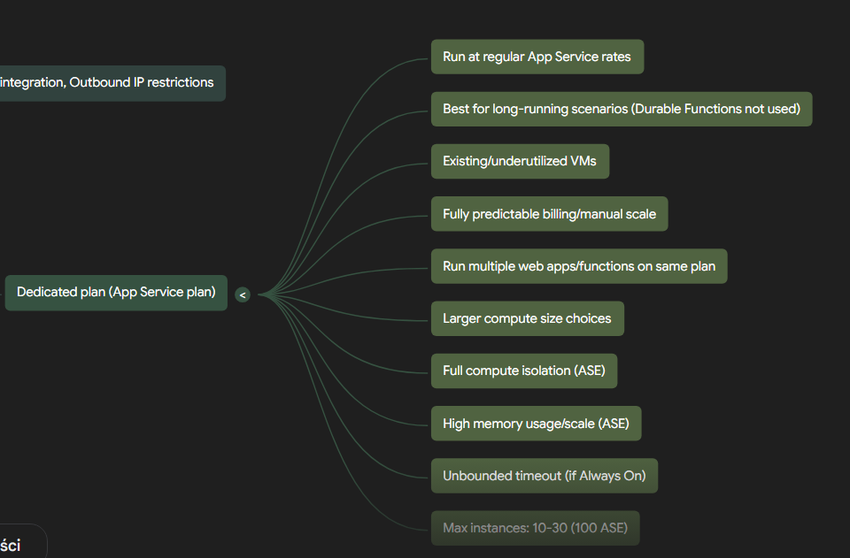
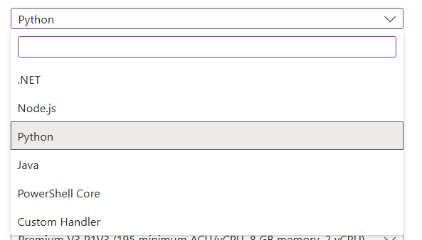
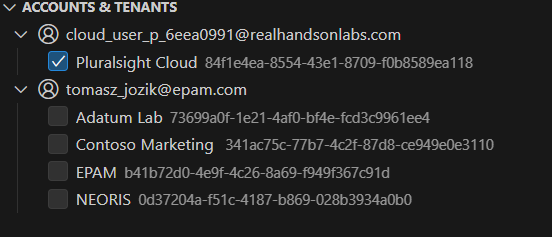

Deploy an Azure Function

    1. Create Function App
    2. Select a hosting option







Azure Functions offers various hosting options, each with different scaling and billing behaviors. The concept of "pay-as-you-go" generally means you pay for the resources you consume, without large upfront costs [conversation history]. For Azure Functions, this model is most evident in plans that dynamically scale instances and can even scale to zero when idle, meaning you primarily pay for execution time.

Here's a comparison of hosting plans based on their "pay-as-you-go" characteristic:

| Hosting Plan         | Pay-as-you-go | Explanation/Details                                                                                                                                                                                                                                                                                                                                                                                                                                    |
| :------------------- | :------------ | :----------------------------------------------------------------------------------------------------------------------------------------------------------------------------------------------------------------------------------------------------------------------------------------------------------------------------------------------------------------------------------------------------------------------------------------------------- |
| **Consumption plan** | **Yes**         | This is the **default hosting plan** that provides **true serverless hosting**. You **pay only for the time your functions run**. Billing is based on the number of executions, execution time, and memory used. Apps can **scale to zero when idle**, meaning there's **no charge for time spent waiting for external events**. It scales automatically, even during periods of high load.                                                                         |
| **Flex Consumption plan** | **Yes**         | This plan offers **pay-as-you-go billing**. Billing is based on the number of executions and the memory of instances when they're actively executing functions. However, it also includes the **cost of any always-ready instances** that you may configure, which can help reduce cold starts. Instances are dynamically added and removed based on configured per-instance concurrency and incoming events.                                      |
| **Premium plan**     | **No**          | This plan is designed for scenarios where you need prewarmed workers to avoid cold starts and require more control over instances. **At least one instance per plan must always be kept warm**, meaning it incurs continuous costs and does not scale to zero. Billing is based on the number of core seconds and memory used across both needed and prewarmed instances, providing the **most predictable pricing**.                                      |
| **Dedicated plan**   | **No**          | When running functions within a Dedicated (App Service) plan, you pay the same rates as for other App Service resources like web apps. This option is chosen when you have existing, underutilized virtual machines, need **fully predictable billing**, or want to manually scale instances. Functions run continuously on a prescribed number of instances, so cold start is not an issue.                                                                    |
| **Container Apps**   | **Yes**         | Functions hosted on Container Apps can be configured to scale to zero when idle if the minimum number of replicas is set to zero. In this configuration, some requests might experience higher latencies at startup. If the minimum number of replicas is set to one or more, the host process runs continuously, meaning cold start is not an issue, but you would incur continuous costs. Billing is based on your specific plan type within Azure Container Apps. |

Azure Functions is a serverless solution that allows you to build robust applications with less code, infrastructure, and lower costs by leveraging cloud infrastructure to provide necessary resources. It's designed to react to various critical events, making it suitable for scenarios like building web APIs, responding to database changes, and processing event streams or messages.


Here is a table detailing the billing type and billing description for each Azure Functions hosting plan:

| Hosting Plan | Billing Type | Billing Description |
| :----------- | :----------- | :------------------ |
| **Flex Consumption plan** | Pay-as-you-go with always-ready instance costs | Billing is based on the **number of executions**, the **memory of instances when they're actively executing functions**, and the **cost of any always ready instances**. |
| **Premium plan** | Predictable pricing based on usage of prewarmed instances | Billing is based on the **number of core seconds and memory used** across needed and prewarmed instances. At least one instance per plan must always be kept warm, providing the most predictable pricing. |
| **Dedicated plan** | Standard App Service plan rates or flat monthly rate for App Service Environment (ASE) | You pay the **same as for other App Service resources, like web apps**. For an App Service Environment (ASE), there is a **flat monthly rate for infrastructure** that doesn't change with environment size, plus a **cost per App Service plan vCPU**. All apps hosted in an ASE are in the Isolated pricing SKU. |
| **Container Apps** | Based on your plan type | Billing in Azure Container Apps is **based on your specific plan type**. |
| **Consumption plan** | True serverless pay-as-you-go | You **pay only for the time your functions run**. Billing is based on the **number of executions, execution time, and memory used**. |

Here is a table detailing the primary lack of some functionality for each Azure Functions hosting plan, based on the provided sources and our conversation history:

| Hosting Plan | Primary lack of some functionality |
| :----------- | :------------------------------- |
| **Flex Consumption plan** | •   **No Windows deployment support**.<br>•   **Does not support container deployments**.<br>•   Total memory usage across all instances in a given region is limited by a **regional subscription quota** [51 note 1].<br>•   Has limited temporary (0.8 GB) and persisted (0 GB) storage.<br>•   Does not support deployment slots. |
| **Premium plan** | •   **Incurs costs for prewarmed instances** even when idle, as at least one instance per plan must always be kept warm. This contrasts with the true pay-per-execution model of the Consumption plan.<br>•   Scaling for HTTP triggers restricted by private endpoints is **limited to a maximum of 20 instances** [51 note 6].<br>•   Linux apps on a Premium plan can scale to 100 instances only in **some regions**, not universally [51 note 2]. |
| **Dedicated plan** | •   **Requires manual or autoscale configuration** rather than automatic event-driven scaling.<br>•   **Billing is based on regular App Service plan rates**, which can be less cost-efficient for intermittent or highly variable workloads compared to pay-as-you-go models.<br>•   Requires the App Service plan to be set to **"Always On"** for unbounded function timeouts, implying continuous billing even when functions are idle [50 note 3].<br>•   **Does not support Windows containers**. |
| **Container Apps** | •   **Supports container deployments only**, meaning code-only deployments are not an option.<br>•   **No Windows deployment support**.<br>•   **Does not support custom domains or custom domain TSL/SSL**.<br>•   **Can experience cold starts** if the minimum number of replicas is set to zero, as apps can scale to zero when idle. |
| **Consumption plan** | •   Has a **limited maximum time-out duration of 10 minutes** for function executions, and HTTP triggered functions have a hard limit of 230 seconds due to the Azure Load Balancer's idle timeout. This makes it unsuitable for very long-running processes without leveraging Durable Functions patterns.<br>•   **Experiences cold starts** because apps can scale to zero when idle.<br>•   **Does not support container deployments**.<br>•   **Lacks built-in Azure Virtual Network connectivity**.<br>•   Offers **more limited CPU or memory options** compared to Premium plans.<br>•   Has more **restricted outbound connections** compared to other plans.<br>•   Supports only the **CNAME option for custom domains** [53 note 8]. |


Drawing on the information in the provided sources and our conversation history, I can suggest several additional features that would enhance your comparison of Azure Functions hosting plans. These features delve deeper into the operational characteristics, performance, and resource availability of each plan.


Certainly! Drawing upon the comprehensive information from the sources and our previous conversation, I will enhance the comparison table for Azure Functions hosting plans by adding the suggested new columns and refining existing data with precise citations.

Here is the updated table:

| Features to Compare                      | **Flex Consumption plan** | **Consumption plan** | **Premium plan** | **Dedicated plan** | **Container Apps** |
| :--------------------------------------- | :------------------------ | :------------------- | :--------------- | :----------------- | :----------------- |
| **Windows deployment support**           | ❌                   | ✅              | ✅          | ✅            | ❌            |
| **Support container deployment**         | ❌                   | ❌              | ✅          | ✅            | ✅            |
| **Support deployment slots**             | ❌                   | ✅              | ✅          | ✅            | ❌            |
| **Autoscale configuration**              | ✅               | ✅          | ✅      | ✅            | ✅        |
| **Support custom domains**               | ✅                   | ✅              | ✅          | ✅            | ❌            |
| **Support TSL/SSL**                      | ✅                   | ✅              | ✅          | ✅            | ❌            |
| **Virtual network connectivity**         | ✅               | ✅              | ✅      | ✅        | ✅            |
| **No delay after idle (Warm instances)** | ✅                   | ❌              | ✅          | ✅            | ✅            |
| **Horizontal scaling**                   | ✅                   | ✅              | ✅          | ✅            | ✅            |
| **Vertical scaling**                     | ✅                   | ❌                   | ✅          | ✅            | ✅            |
| **Scale to zero**                        | ✅                   | ✅              | ❌          | ❌            | ✅            |
| **Linux image support (custom)**         | ❌                   | ❌              | ✅      | ✅        | ✅            |
| **Default Time-out Duration (min)**      | 30                   | 5               | 30          | 30            | 30            |
| **Max Time-out Duration (min)**          | Unbounded¹           | 10              | Unbounded¹  | Unbounded²    | Unbounded³    |
| **Max Instances**                        | 1000⁴                | 200 (Win) / 100 (Lin)⁵ | 100 (Win) / 20-100 (Lin)⁶ | 10-30 (100 ASE)⁷ | 300-1000⁸     |
| **Max Memory per Instance (GB)**         | 4                    | 1.5             | 3.5-14      | 1.75-256 (8-256 ASE)⁹ | Varies        |
| **Function Apps per Plan**               | 1                    | 100             | 100         | Unbounded¹⁰   | Unbounded¹⁰   |
| **Cold Start Behavior**                  | Reduced with always ready instances | Can scale to zero, higher latency at startup; optimizations like prewarmed placeholders | Avoided with always ready instances | Not an issue as host runs continuously | Depends on min replicas (zero: higher latency; one+: no issue) |
| **Temporary Storage per Instance (GB)**  | 0.8                  | 0.5 (Win) / 1.5 (Lin)¹¹ | 21-140      | 11-140        | n/a           |
| **Persisted Storage per App (GB)**       | 0                    | 1¹²             | 250         | 10-1000       | n/a           |
| **Deployment Slots per App**             | n/a                  | 2¹³             | 3¹³         | 1-20          | Not supported |
| **Compute Isolation / Dedicated Env.**   | ❌                        | ❌                   | ❌               | ✅ (Full isolation with App Service Environment) | ❌                 |
| **GPU Support**                          | ❌                        | ❌                   | ❌               | ❌                 | ✅            |

---

**Symbol Explanations:**

*   **✅** (Yes) – The feature is supported or available in the given hosting plan.
*   **❌** (No) – The feature is not supported or available in the given hosting plan.
*   **n/a** (Not applicable) – The feature does not apply to this hosting plan.

**Additional Notes on Table Data:**

1.  **Unbounded Max Time-out Duration (Flex Consumption & Premium Plans):** There is no enforced maximum execution time-out duration. However, a grace period of 60 minutes is given during scale-in and 10 minutes during platform updates. HTTP-triggered functions have a maximum response time of 230 seconds due to the Azure Load Balancer's default idle time-out.
2.  **Unbounded Max Time-out Duration (Dedicated Plan):** This requires the App Service plan to be set to "Always On". A grace period of 10 minutes is given during platform updates.
3.  **Unbounded Max Time-out Duration (Container Apps):** When the minimum number of replicas is set to zero, the default time-out depends on the specific triggers used in the app. If set to one or more, the host process runs continuously.
4.  **Max Instances (Flex Consumption Plan):** This plan has a regional subscription quota limiting total memory usage across a region, and currently only supports Linux.
5.  **Max Instances (Consumption Plan):** The maximum is **200** instances for Windows and **100** for Linux. During scale-out, there's a current limit of **500** instances per subscription per hour for Linux apps on a Consumption plan.
6.  **Max Instances (Premium Plan):** The maximum is **100** instances for Windows, and **20-100** instances for Linux (in some regions, Linux apps on a Premium plan can scale to 100 instances). For private endpoint restricted HTTP triggers, scaling out is limited to at most **20** instances.
7.  **Max Instances (Dedicated Plan):** The typical maximum is **10-30**, but can go up to **100** in an App Service Environment (ASE). Specific limits depend on App Service plan options.
8.  **Max Instances (Container Apps):** The default is 10 instances, but you can set the maximum number of replicas up to **1000**. When creating a function app from the Azure portal, you are limited to **300** instances.
9.  **Max Memory per Instance (Dedicated Plan):** This varies from **1.75 GB to 256 GB** for a standard App Service plan, and from **8 GB to 256 GB** for an App Service Environment (ASE), depending on the chosen size.
10. **Function Apps per Plan (Dedicated & Container Apps):** While listed as "unbounded", the actual number of function apps you can host depends on the activity, machine instance size, and resource utilization. There's also a subscription limit of 5,000 function apps.
11. **Temporary Storage per Instance (Consumption Plan):** The storage limit is 0.5 GB, but it's 1.5 GB for Linux Consumption plans.
12. **Persisted Storage per App (Consumption Plan):** Consumption plan uses an Azure Files share. For Linux, you must explicitly mount your own Azure Files share.
13. **Deployment Slots per App:** This count includes the production slot.

This enhanced table provides a more detailed comparison of the Azure Functions hosting plans, covering aspects like cold start behavior, various storage limits, and specific advanced features like GPU support and compute isolation, all supported by the provided sources.

Deciding on a hosting plan for your Azure Functions is a **critical decision** that directly influences your application's **scalability, available resources, support for advanced features, and operational costs**. It requires evaluating several factors to align with your specific requirements for performance, cost efficiency, scaling behavior, network access, and desired level of environment isolation.

Here's how to decide on a hosting plan:

### 1. Assess Scaling and Cost Model

*   **Consumption Plan**:
    *   This is the **default and truly serverless option**.
    *   You **pay only for compute resources when your functions are actively running** (pay-as-you-go).
    *   It **automatically scales out** based on incoming events and scales to zero when idle.
    *   Ideal for **event-driven, intermittent workloads** where cost predictability is less critical than paying only for actual execution.
    *   Can scale up to 200 instances on Windows and 100 on Linux.
    *   Experiences **cold starts** as apps can scale to zero when idle, though optimizations exist to decrease this.

*   **Flex Consumption Plan**:
    *   A newer option **(Linux only)** offering **rapid horizontal scaling** and pay-as-you-go billing, similar to Consumption.
    *   Provides **compute choices and virtual networking support**.
    *   Can **reduce cold starts by specifying "always ready" instances**.
    *   Suitable if you need serverless billing with **better control over cold starts and networking features**.
    *   Scaling decisions are on a per-function basis, providing deterministic scaling, up to 1000 instances.

*   **Premium Plan**:
    *   Designed for apps running **continuously or nearly continuously**.
    *   Provides **prewarmed instances to eliminate cold start delays**.
    *   Billing is based on core seconds and memory used, offering **more predictable pricing**.
    *   Choose this plan if **cold starts are unacceptable**, you need more CPU/memory, greater control over instances, or virtual network connectivity.
    *   Supports custom Linux images.
    *   Can scale to 100 instances on Windows and 20-100 on Linux.

*   **Dedicated Plan (App Service Plan)**:
    *   Allows hosting functions within an existing App Service plan, providing **fully predictable billing** and the ability to manually scale instances.
    *   **Cold starts are not an issue** as the host runs continuously.
    *   Beneficial if you have **existing, underutilized virtual machines** or require full compute isolation (via App Service Environment - ASE).
    *   Allows running multiple web apps and function apps on the same plan.
    *   Supports custom Linux images.

*   **Container Apps**:
    *   For **containerized function apps**, it's a fully managed environment.
    *   **Cold start behavior depends on the minimum number of replicas**; setting it to one or more eliminates cold starts.
    *   Choose this if you want to **package custom libraries**, migrate legacy apps to cloud-native microservices, or need **high-end processing power like GPU resources**, while avoiding Kubernetes complexity.
    *   Supports Linux containers only.
    *   Can scale up to 1000 instances, though portal creation limits to 300.

### 2. Consider Execution Duration and Cold Starts

*   For **short, burstable tasks**, the Consumption plan's 10-minute maximum timeout is usually sufficient. HTTP triggered functions have a maximum response time of 230 seconds due to Azure Load Balancer.
*   For **longer-running functions** (e.g., beyond 10 minutes up to unbounded duration), Flex Consumption, Premium, Dedicated, or Container Apps are more suitable, as they offer longer or unbounded timeouts.
*   If **cold starts are a critical concern** for user experience (e.g., for APIs with strict latency requirements), opt for **Premium or Flex Consumption with "always ready" instances**, or Dedicated/Container Apps with a minimum number of instances.

### 3. Evaluate Networking Requirements

*   If your functions need to connect securely to resources within an **Azure Virtual Network** (e.g., databases, other services), the **Flex Consumption, Premium, Dedicated, or Container Apps** plans support virtual network integration and private endpoints.
*   The Consumption plan also supports inbound private endpoints and virtual network integration, but with special considerations for triggers.

### 4. Determine Container Support Needs

*   If you require deploying your functions in **custom Linux containers** (e.g., for specific dependencies or environment control), the **Premium, Dedicated, or Container Apps plans** are necessary.
*   Consumption and Flex Consumption plans do not support custom containers.

### 5. Factor in Specific Application Scenarios

*   **Long-running Orchestrations/Workflows**: If your application involves complex, stateful, or long-running workflows (e.g., multi-step approvals, fan-out/fan-in processing), **Durable Functions** is a key extension. Durable Functions can run on Consumption, Premium, and Dedicated plans, and is billed the same as Azure Functions. It enables stateful functions, managing state, checkpoints, and restarts for you. Common patterns include function chaining, fan-out/fan-in, async HTTP APIs, monitoring, human interaction, and stateful entities (aggregators).
*   **AI/Machine Learning**: Azure Functions provides serverless compute resources that integrate with AI and Azure services to build cloud-hosted intelligent applications. Benefits include **rapid, event-driven scaling**, **built-in support for Azure OpenAI** (for agents, assistants, RAG workflows), broad language and library support, and **orchestration capabilities** via Durable Functions for complex AI agent workflows. Functions are effective for real-time AI scenarios like **Retrieval-Augmented Generation (RAG) systems** due to their ability to handle multiple events and reduce latency. They are also ideal for implementing **Assistant function calling** in agentic workflows and simplifying the creation of **Remote Model Context Protocol (MCP) servers**. Container Apps can support functions needing **GPU compute resources** for high-end processing.
*   **Existing Infrastructure**: If you already have underutilized App Service resources, a **Dedicated plan** can be cost-effective by leveraging existing virtual machines.
*   **Common Scenarios for Azure Functions**: Azure Functions are widely used for various event-driven systems, including:
    *   **Processing file uploads**: Running code when a file is uploaded or changed in blob storage, such as validating and transforming product catalog information.
    *   **Real-time stream and event processing**: Capturing and transforming data from event and IoT source streams in near real-time, storing it in databases like Azure Cosmos DB for analytics.
    *   **Running scheduled tasks**: Executing code based on a cron schedule, such as data clean-up or analyzing databases for duplicate entries.
    *   **Building scalable web APIs**: Defining HTTP endpoints to connect to other services or compose into web-based APIs, or as webhook integrations (e.g., GitHub webhooks).
    *   **Responding to database changes**: Running custom logic when data is created or updated in a database (e.g., logging or auditing).
    *   **Creating reliable message systems**: Processing message queues using Azure Storage queues, Service Bus, or Event Hubs for event-driven messaging solutions.

### 6. Be Aware of Resource Group Limitations

*   When creating a new hosting plan in an existing resource group, you might encounter errors if the group previously contained an incompatible function app or web app (e.g., different SKU, operating system, or platform features).
*   This happens because resource groups are mapped to specific pools of resources with different infrastructure capabilities.
*   In such cases, the recommended solution is to **create your function app and hosting plan in a new resource group**.

By carefully weighing these factors against your application's requirements, you can select the most appropriate Azure Functions hosting plan.

**LINK do NoteBookLM**
https://notebooklm.google.com/notebook/20ff274f-d71a-4eb7-8411-0ab787e45118?authuser=1


-------------------------------------------------------
# Deploy an Azure Function
    Click the Resource Group drop-down and pick your resource group.
    Give your function app a unique Function App name.
    Click on the Runtime stack drop-down.
    Choose Python.

    

    Click on the Region drop-down and set it to the same region as your resource group.
    Click on the Pricing plan drop-down.
    Select the Basic B1 pricing plan.
    If you don't see the Basic B1 plan, click Explore pricing plans and select it.
    Click Review + create.
    Click Create. It will take about one to two minutes to deploy.
    Click Go to resource.


    # Create a Sample Application
    
In your Visual Studio Code (VSCode), in the left-hand navigation bar, click Extensions.

In the search box, search for function.

Click Install on the Azure Functions extension.

In the left-hand navigation bar, click the Azure extension.

Under Workspace, click on Create Function Project....

Click New Folder and name it function.

This and the next step especially, and others maybe too, may differ slightly depending on your operating system. Adjust accordingly.
Click the function folder and click Select.

At the top of the VSCode window, select Python.

Then select Model V2.

Choose Skip virtual environment.

Choose HTTP trigger for the template.

Press Enter to confirm the default name of the function, http_trigger.

Select ANONYMOUS for authorization level.

Select Open in current window.

If prompted, click Yes, I trust the authors.

In the left-hand explorer view, click function_app.py to view the code you are about to execute.

In the left-hand navigation bar, click the Azure extension.

Under RESOURCES, click on Sign in to Azure....

Click Allow when asked to sign in to Microsoft.

You will now be prompted in your browser to sign in.

From your lab Credentials, copy the Username, and paste it in the Sign in field.

You may be prompted to Pick an account, in which case first click Use another account.
Click Next.

From your lab Credentials, copy the Password, and paste it in the Enter Temporary Access Pass field.

Click Sign in.


When Issue"
```
    az account clear
    az config set core.enable_broker_on_windows=false
    az login
```
or use add account



If you get an Automatically sign in to all desktop apps and websites on this device pop-up, click No, this app only.

Under RESOURCES, expand your Lab Subscription.

It'll be the only option, and its name will likely contain Real Hands-On Labs.

Click to expand Function App.

Right-click your function app, and click Deploy to Function App....

There'll be only one function app, the one you named earlier.

Click Deploy.

Wait at least five minutes for the code to deploy to the function app.

You will likely see a Succeeded message, but still wait the five minutes.
Expand your function app. You will see options, including Functions.

Right-click your function app and click Refresh. Expand Functions. You should see the http_trigger function under.

Note: If you do not see the http_trigger function, follow the steps below:

Right-click your function app and again click Deploy to Function App....
Click Deploy.
Wait at least 10 minutes for the code to deploy.
If you notice http_trigger show up, though, you can quit waiting and move on.
Right-click your function app and click Refresh.
Right-click http_trigger and click Copy Function URL.

In a new browser tab, paste in the copied Function URL, and then press Enter to navigate to it.

You'll see a This HTTP triggered function ... message.

At the end of the url in the address bar, add ?name=YourName.

Press Enter and observe the function has returned your name.


# Deploy Web Scraping Code to the Azure Function
At the GitHub repo. window, click function_app.py.

Click Copy raw file.

In VSCode in the upper-left, click Explorer, then double-click function_app.py to open it.

Highlight all code in the function_app.py file, and paste in the copied code.

Save the file using File > Save or Control+S (or Command+S).

On the left, double-click requirements.txt.

In GitHub, navigate back on page.

Click requirements.txt.

Click Copy raw file.

In VSCode, highlight all the contents in the requirements.txt file and paste in the copied code.

Save the file using File > Save or Control+S.

Right-click on the blank space in the Explorer pane on the left, and click Deploy to Function App....

At the top of the window from the drop-down, choose your function app.

Click Deploy.

Wait at least five minutes for the code to deploy to the function app.

Go back to the Azure portal, and on the left expand Functions.

Click App files.

Click Refresh.

Click the drop-down on host.json.

Choose function_app.py.

Observe the new web scraping code.

Open the Function window, and remove the ?name=YourName parameter at the end of the URL.

Press Enter to make a new request.

Observe the dataset returned from function, which will start with First dataset.

Back in the Azure portal, and copy the URL from line 14.

In a new browser tab, navigate to the copied URL.

Click the first dataset on this page.

The URL of this dataset will match the URL returned from the function app.