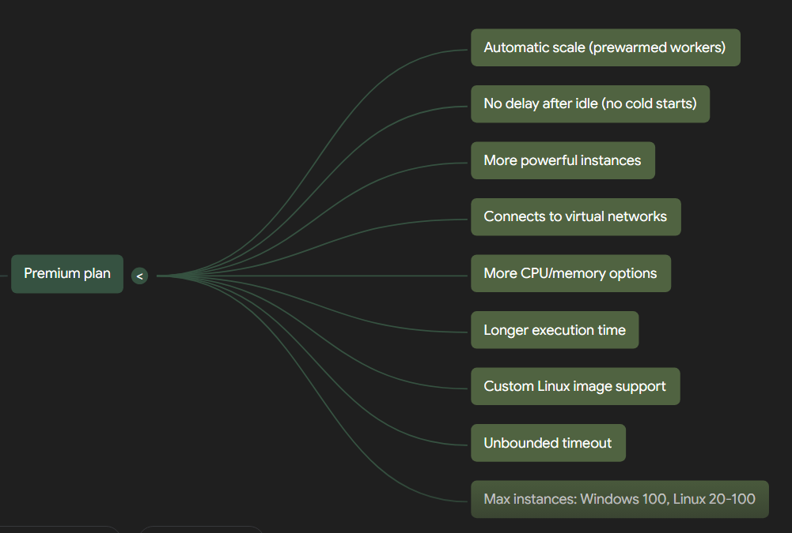

Deploy an Azure Function

    1. Create Function App
    2. Select a hosting option

Azure Functions offers various hosting options, each with different scaling and billing behaviors. The concept of "pay-as-you-go" generally means you pay for the resources you consume, without large upfront costs [conversation history]. For Azure Functions, this model is most evident in plans that dynamically scale instances and can even scale to zero when idle, meaning you primarily pay for execution time.

Here's a comparison of hosting plans based on their "pay-as-you-go" characteristic:

| Hosting Plan         | Pay-as-you-go | Explanation/Details                                                                                                                                                                                                                                                                                                                                                                                                                                    |
| :------------------- | :------------ | :----------------------------------------------------------------------------------------------------------------------------------------------------------------------------------------------------------------------------------------------------------------------------------------------------------------------------------------------------------------------------------------------------------------------------------------------------- |
| **Consumption plan** | **Yes**         | This is the **default hosting plan** that provides **true serverless hosting**. You **pay only for the time your functions run**. Billing is based on the number of executions, execution time, and memory used. Apps can **scale to zero when idle**, meaning there's **no charge for time spent waiting for external events**. It scales automatically, even during periods of high load.                                                                         |
| **Flex Consumption plan** | **Yes**         | This plan offers **pay-as-you-go billing**. Billing is based on the number of executions and the memory of instances when they're actively executing functions. However, it also includes the **cost of any always-ready instances** that you may configure, which can help reduce cold starts. Instances are dynamically added and removed based on configured per-instance concurrency and incoming events.                                      |
| **Premium plan**     | **No**          | This plan is designed for scenarios where you need prewarmed workers to avoid cold starts and require more control over instances. **At least one instance per plan must always be kept warm**, meaning it incurs continuous costs and does not scale to zero. Billing is based on the number of core seconds and memory used across both needed and prewarmed instances, providing the **most predictable pricing**.                                      |
| **Dedicated plan**   | **No**          | When running functions within a Dedicated (App Service) plan, you pay the same rates as for other App Service resources like web apps. This option is chosen when you have existing, underutilized virtual machines, need **fully predictable billing**, or want to manually scale instances. Functions run continuously on a prescribed number of instances, so cold start is not an issue.                                                                    |
| **Container Apps**   | **Yes**         | Functions hosted on Container Apps can be configured to scale to zero when idle if the minimum number of replicas is set to zero. In this configuration, some requests might experience higher latencies at startup. If the minimum number of replicas is set to one or more, the host process runs continuously, meaning cold start is not an issue, but you would incur continuous costs. Billing is based on your specific plan type within Azure Container Apps. |

Azure Functions is a serverless solution that allows you to build robust applications with less code, infrastructure, and lower costs by leveraging cloud infrastructure to provide necessary resources. It's designed to react to various critical events, making it suitable for scenarios like building web APIs, responding to database changes, and processing event streams or messages.

Here is a table detailing the billing type and billing description for each Azure Functions hosting plan:

| Hosting Plan | Billing Type | Billing Description |
| :----------- | :----------- | :------------------ |
| **Flex Consumption plan** | Pay-as-you-go with always-ready instance costs | Billing is based on the **number of executions**, the **memory of instances when they're actively executing functions**, and the **cost of any always ready instances**. |
| **Premium plan** | Predictable pricing based on usage of prewarmed instances | Billing is based on the **number of core seconds and memory used** across needed and prewarmed instances. At least one instance per plan must always be kept warm, providing the most predictable pricing. |
| **Dedicated plan** | Standard App Service plan rates or flat monthly rate for App Service Environment (ASE) | You pay the **same as for other App Service resources, like web apps**. For an App Service Environment (ASE), there is a **flat monthly rate for infrastructure** that doesn't change with environment size, plus a **cost per App Service plan vCPU**. All apps hosted in an ASE are in the Isolated pricing SKU. |
| **Container Apps** | Based on your plan type | Billing in Azure Container Apps is **based on your specific plan type**. |
| **Consumption plan** | True serverless pay-as-you-go | You **pay only for the time your functions run**. Billing is based on the **number of executions, execution time, and memory used**. |

Here is a table detailing the primary lack of some functionality for each Azure Functions hosting plan, based on the provided sources and our conversation history:

| Hosting Plan | Primary lack of some functionality |
| :----------- | :------------------------------- |
| **Flex Consumption plan** | •   **No Windows deployment support**. •   **Does not support container deployments**. •   Total memory usage across all instances in a given region is limited by a **regional subscription quota** [51 note 1]. •   Has limited temporary (0.8 GB) and persisted (0 GB) storage. •   Does not support deployment slots. |
| **Premium plan** | •   **Incurs costs for prewarmed instances** even when idle, as at least one instance per plan must always be kept warm. This contrasts with the true pay-per-execution model of the Consumption plan. •   Scaling for HTTP triggers restricted by private endpoints is **limited to a maximum of 20 instances** [51 note 6]. •   Linux apps on a Premium plan can scale to 100 instances only in **some regions**, not universally [51 note 2]. |
| **Dedicated plan** | •   **Requires manual or autoscale configuration** rather than automatic event-driven scaling. •   **Billing is based on regular App Service plan rates**, which can be less cost-efficient for intermittent or highly variable workloads compared to pay-as-you-go models. •   Requires the App Service plan to be set to **"Always On"** for unbounded function timeouts, implying continuous billing even when functions are idle [50 note 3]. •   **Does not support Windows containers**. |
| **Container Apps** | •   **Supports container deployments only**, meaning code-only deployments are not an option. •   **No Windows deployment support**. •   **Does not support custom domains or custom domain TSL/SSL**. •   **Can experience cold starts** if the minimum number of replicas is set to zero, as apps can scale to zero when idle. |
| **Consumption plan** | •   Has a **limited maximum time-out duration of 10 minutes** for function executions, and HTTP triggered functions have a hard limit of 230 seconds due to the Azure Load Balancer's idle timeout. This makes it unsuitable for very long-running processes without leveraging Durable Functions patterns. •   **Experiences cold starts** because apps can scale to zero when idle. •   **Does not support container deployments**. •   **Lacks built-in Azure Virtual Network connectivity**. •   Offers **more limited CPU or memory options** compared to Premium plans. •   Has more **restricted outbound connections** compared to other plans. •   Supports only the **CNAME option for custom domains** [53 note 8]. |